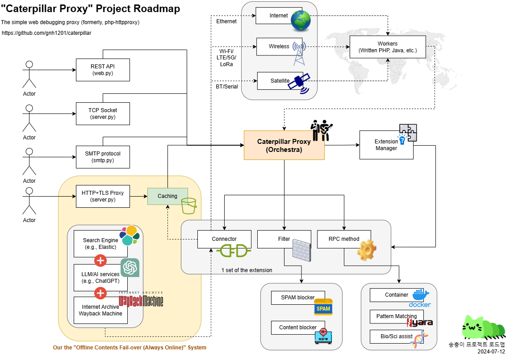

# Caterpillar Proxy (Songchoongi Project)

[](https://app.fossa.com/projects/git%2Bgithub.com%2Fgnh1201%2Fcaterpillar?ref=badge_shield)
[](https://doi.org/10.5281/zenodo.13346533)
[](#)
[](https://www.slideshare.net/slideshow/2024-caterpillar-project-in-2024-korea-oss-contest/273031732)

Caterpillar Proxy (Songchoongi Project) - The simple web debugging proxy (formerly, php-httpproxy)


You can connect all physical and logical channels with communication capabilities to the web!

Imagine various means such as time machines, satellites, quantum technology, sound, light, the Philosopher's Stone, or Excalibur, just like in science fiction movies! Caterpillar Proxy supports the implementation of extensions for Connectors, Filters, and RPC methods to bring your imagination to life.

:rocket: [Open the Caterpillar Proxy Web Console](https://pub-1a7a176eea68479cb5423e44273657ad.r2.dev/console.html)

## Use cases
* [Build a network tunnel using Python and the LAMP(PHP) stack (qiita.com)](https://qiita.com/gnh1201/items/40f9350ca6d308def6d4)
* [K-Anonymity for Spam Filtering: Case with Mastodon, and Misskey (qiita.com)](https://qiita.com/gnh1201/items/09f4081f84610db3a9d3)
* [File Upload Vulnerability Attack Test (Caterpillar Proxy) (youtu.be) ](https://youtu.be/sPZOCgYtLRw)
* Real-time processing of emergency disaster sensor data (e.g., fire detection).

## How it works

### Basic structure
```
* You <-> Proxy client (Python) <-> Parasitized proxy server (Optional, PHP/LAMP) <-> On the Web
* You <-> Proxy client (Python) <-> Connector extensions (Optional, Python) <-> On the Web
```

For example, build a simple web debugging proxy on the shared servers.

### Stateful mode
This project supports two modes of connection. The default is stateless. You can use the stateful mode to avoid being constrained by transfer capacity limits. See the [Stateful mode (catswords-oss.rdbl.io)](https://catswords-oss.rdbl.io/1155378128/5211324242).

### Connector extensions
This project supports the implementation of Connector extensions. The provided basic examples include implementations of web archives (caches) and serial communication as Connector extensions. Go to the [caterpillar-plugins repository (github.com)](https://github.com/gnh1201/caterpillar-plugins)

## (Optional) Before to use
If you have a server that ***will be parasitized*** and you want to proxy it, you should upload the `index.php` file to a shared server. The index.php file is located in the `assets/php` directory within this repository.

## How to use
1. Write a file `.env`(Linux) or `settings.ini`(Windows). Like this:

```
[settings]
CONNECTION_TIMEOUT=1
PORT=5555
SERVER_URL=localhost
SERVER_CONNECTION_TYPE=
CA_KEY=ca.key
CA_CERT=ca.crt
CERT_KEY=cert.key
CERT_DIR=certs/
OPENSSL_BINPATH=openssl
CLIENT_ENCODING=utf-8
USE_EXTENSIONS=wayback.Wayback,bio.PyBio
```

***Note***: If using Caterpillar Proxy (Python) alone, set `SERVER_URL=localhost`. Otherwise, use the endpoint URL of the Worker script (PHP or Java), e.g., `SERVER_URL=http://example.org`.

- (Optional) Create a certificate for SSL decryption

```bash
chmod +x configure_certs.sh
./configure_certs.sh
sudo apt-get install -y ca-certificates
sudo cp ca.crt /usr/local/share/ca-certificates/caterpillar-ca.crt
sudo update-ca-certificates
```

2. Run `python3 server.py` and set HTTP(S) proxy in your web browser (e.g. Firefox, Chromium)

3. Test [100MB](http://speed.hetzner.de/100MB.bin)/[SSL](https://speed.hetzner.de/100MB.bin), [1GB](http://speed.hetzner.de/1GB.bin)/[SSL](https://speed.hetzner.de/1GB.bin), [10GB](http://speed.hetzner.de/10GB.bin)/[SSL](http://speed.hetzner.de/10GB.bin) download and check the speed.

3. Enjoy it

4. (Optional) With [Cloudflare](https://cloudflare.com), we can expect to accelerate the 4x speed and reduce the network stuck.

## Extensions
* [Web Console](https://pub-1a7a176eea68479cb5423e44273657ad.r2.dev/console.html)
* Fediverse (e.g., Mastodon): See the [Fediverse (catswords-oss.rdbl.io)](https://catswords-oss.rdbl.io/1155378128/3821602484).
* Wayback (Private browsing with Google or Wayback cache): See the [Wayback (catswords-oss.rdbl.io)](https://catswords-oss.rdbl.io/1155378128/6994492654)

## Thanks to
* Pan Art by [@yeohangdang@i.peacht.art](#): [Image File](assets/img/logo.png)
* [GitHub Sponsors](https://github.com/sponsors/gnh1201)

## Contributors
<a href="https://github.com/gnh1201/caterpillar/graphs/contributors">
  
</a>

## Our roadmap


## Report abuse
- abuse@catswords.net
- [GitHub Security Advisories (gnh1201/caterpillar)](https://github.com/gnh1201/caterpillar/security)

## Join the community
- ActivityPub [@catswords_oss@catswords.social](https://catswords.social/@catswords_oss)
- XMPP [catswords@conference.omemo.id](xmpp:catswords@conference.omemo.id?join)
- [Join Catswords OSS on Microsoft Teams (teams.live.com)](https://teams.live.com/l/community/FEACHncAhq8ldnojAI)
- [Join Catswords OSS #caterpillar on Discord (discord.gg)](https://discord.gg/9VVTHpfsVW)

## Special channels
- [A paid consultation channel (m.expert.naver.com)](https://m.expert.naver.com/mobile/expert/product/detail?storeId=100051156&productId=100144540) is available for Korean (한국어) customers.
- [Join the private operation channel (forms.gle)](https://forms.gle/ZKAAaGTiGamksHoo8) is available for Korea region.

## License
[](https://app.fossa.com/projects/git%2Bgithub.com%2Fgnh1201%2Fcaterpillar?ref=badge_large)
