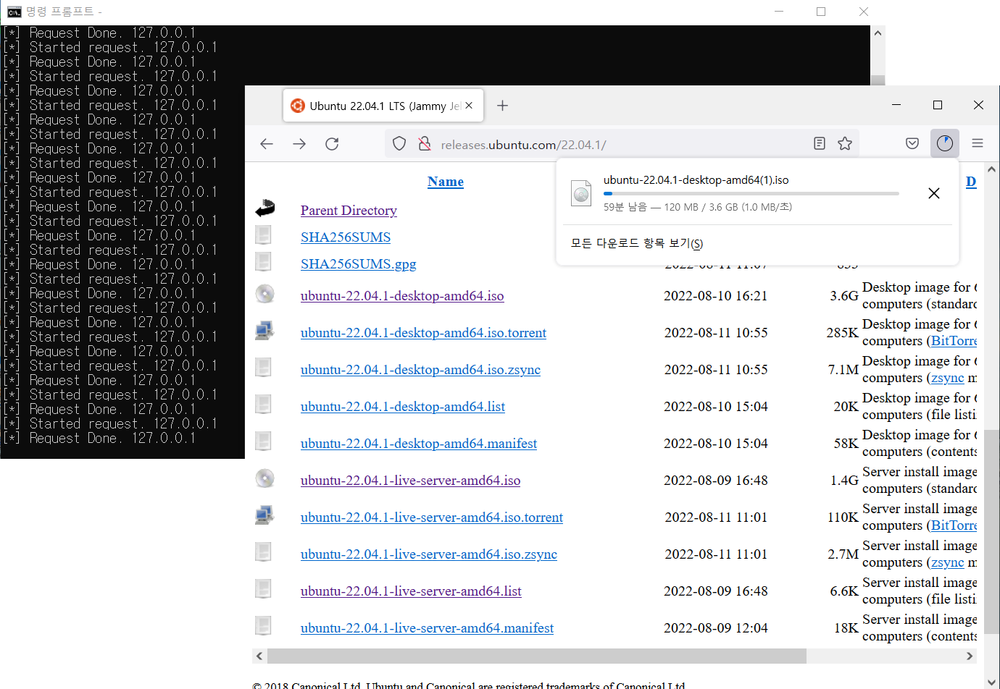

# php-httpproxy
HTTP proxy implementation with PHP socket

## How to works
```
You <-----> HTTP proxy (Python) <-----> Web hosting (PHP) <-----> On the Web
```

HTTP proxy over the web hosting!

## How to use

1. Write a file with filename like `.env`(Linux) or `settings.ini`(Windows). Like this:

```
[settings]
PORT=5555
PROXY_URL=http://example.org
```

2. Run `python server.py` and set HTTP proxy in your web browser (e.g. Firefox)

3. Enjoy it

## Screenshot


## References
* https://github.com/anapeksha/python-proxy-server

## Contact
* gnh1201@gmail.com
